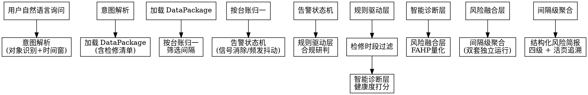

# 继电保护运行风险评估智能体 v2

## Overview

基于多源数据实时融合分析的自动化风险评估引擎。把离散的"缺陷 + 告警 + 监测 + 检修"拼成连续风险趋势，按**间隔（一次设备）**聚合，给运行、调度人员交付**结构化风险简报**。

**三层递进：合规研判（确定性规则 + 告警状态机 + 检修过滤）→ 健康度（数据/知识双驱动）→ 综合量化（FAHP）**

### 关键修订（v1 → v2）

| 问题 | v1（旧）| v2（新）|
|---|---|---|
| 告警抖动 | 简单 `value=告警` 即纳入 | **告警状态机 + 24h ≥ 5 次频发抖动升级** |
| 检修时段 | 不区分 | **自动过滤检修窗口内告警** |
| 站归属错配 | 按告警 JSON station_name 直接拉 | **以台账 station_name 为权威**，告警错标装置不进入评估 |
| 输出粒度 | 单套保护简报 | **按间隔聚合**，含双套独立运行综合 |

## When to Use

用户口径（自然语言直接触发，无需记忆命令）：

- "评估一下 **500kV 皋城变** 皋文 5325 线保护的运行风险"
- "今天有哪些 **间隔** 存在危急缺陷超时风险？"
- "**本周** 全网有哪些严重风险？"
- "**红石变** 保护运行风险"
- "**XX保护装置** 健康度如何？最近有什么异常？"
- "这条线路的 **通道** 状态是否正常？"
- "定值区号是否与 **调度定值单** 一致？"
- 复查风险简报 → "展开 220kV 红马 2C51 间隔的追溯明细"

**不要用于：** 单次录波波形溯因（→ latent-faults），定值单/计算书校核（→ setting-check），倒闸操作票审查（→ safety-ticket-audit），保护误动跳闸分析（→ over-trip-analysis）。

## 数据获取

本技能支持**在线模式**和**离线模式**两种数据获取方式。

### 在线模式（Agent 对话中使用）

使用 nanobot 现有工具获取实时数据：

| 维度 | 工具调用 | 返回数据 |
|---|---|---|
| 静态台账 | `ledger_query(stName=厂站名)` | 设备列表（含 uniqueCode、型号、厂家、投运年限等） |
| 运行状态 | `status_query(voltageType, protectType, stName)` | 主保/后备/重合闸/校核状态统计 |
| 保信定值 | `ledger_query(uniqueCode, queryType=bx_setting)` | 装置实时定值（当前值/标准值/上下限） |
| 硬压板 | `ledger_query(uniqueCode, queryType=hard_press)` | 硬压板状态 |
| 软压板 | `ledger_query(uniqueCode, queryType=soft_press)` | 软压板状态 |
| 模拟量 | `ledger_query(uniqueCode, queryType=analog)` | 模拟量数据 |
| 装置历史告警 | `ledger_query(uniqueCode, queryType=history)` | 告警记录（含 soeTime、告警类型） |
| 保护告警 | `ledger_query(uniqueCode, queryType=protect_alarm)` | 保护告警（动作/复归） |
| 检修记录 | `ledger_query(uniqueCode, queryType=maintenance)` | 检修工作记录 |

**在线模式工作流程：**
1. 用户询问 → 意图解析（厂站/间隔/时间窗）
2. 调用 `ledger_query(stName=厂站)` 获取设备列表
3. 对目标设备逐一调用 `status_query` + `ledger_query(queryType=...)` 获取多维数据
4. 按照本技能的规则引擎进行风险评估
5. 输出结构化风险简报

### 离线模式（直接运行脚本）

使用本地 JSON 文件进行批量分析：

```bash
# 全网扫描
python skills/protection-risk-assessment/scripts/run_risk_assessment.py --scope all

# 指定厂站
python skills/protection-risk-assessment/scripts/run_risk_assessment.py --station 红石变

# 带检修工作清单
python skills/protection-risk-assessment/scripts/run_risk_assessment.py \
    --station 红石变 \
    --maintenance-file 保护装置信息/保护装置检修工作.json

# 仅输出简报，不展开活页
python skills/protection-risk-assessment/scripts/run_risk_assessment.py \
    --station 红石变 --briefing-only
```

### 数据格式映射

在线模式获取的数据字段与离线 JSON 的对应关系：

| 离线 JSON 字段 | 在线工具返回字段 | 说明 |
|---|---|---|
| `station_name` | `ledger_query` 返回的 `stName` | 厂站名 |
| `device_name` | `ledger_query` 返回的 `onceDeviceName` | 需归一化处理 |
| `protection_type` | `ledger_query` 返回的 `protectType` | 保护类型 |
| `set` | `ledger_query` 返回的 `protectCover` | 套别（1/2） |
| `model` | `ledger_query` 返回的 `protectModel` | 保护型号 |
| `settings[].current_value` | `bx_setting` 返回的 `currentValue` | 当前定值 |
| `alarm_priority` | `history` 返回的 `alarmLevel` | 告警级别 |
| `status_name` | `history` 返回的 `alarmContent` | 告警内容 |
| `value` (告警/复归) | `protect_alarm` 返回的 `value` | 1=动作，0=复归 |
| `timestamp` | `history` 返回的 `soeTime` | 告警时间 |

设备名归一化规则（v2）：
- 在线返回 `onceDeviceName` = "220kV崔挥2C55线路第一套保护PCS931A-G" → primary_device = "崔挥2C55线", set_index = 1
- 离线 JSON `device_name` = "崔挥 2C55 线" → primary_device = "崔挥2C55线"
- 两者归一到同一 (station, primary_device, set_index) 键

## 工作流程



**核心算法：**

1. **按台账归一筛选**：`select_targets()` 仅以台账中存在的 (station, primary_device) 为评估范围，避免数据采集错标的"挂错站"装置污染评估。
2. **告警状态机**（详见 `references/alarm_state_machine.md`）：
   - 同一 `(装置, status_name)` 时间序列最后一条 = 告警 → 信号持续
   - 最后一条 = 复归 → 信号已消除（默认不计入）
   - 24h 内同一 status_name 告警次数 ≥ 5 → **频发抖动**，无论是否已复归都升级到"严重"（B5）
3. **检修时段过滤**（详见 `references/maintenance_filtering.md`）：
   - 告警 timestamp 落在维护窗口内 → 完全不计入风险
   - 检修窗口内的频抖也过滤
4. **规则驱动层**（详见 `references/risk_dimension_rules.md`）：A1-A5 / B1-B5 / C1-C2 / D1-D3 共 14 条确定性规则。
5. **智能诊断层**（详见 `references/device_health_index.md`）：活跃告警 + 频发抖动 + 参数异常 + 定值漂移 = HealthIndex ∈ [0,100]。
6. **风险融合层**（详见 `references/fahp_methodology.md`）：FAHP 准则层权重 [二次设备 0.40 / 通道 0.27 / 反措 0.20 / 定值 0.13] → 综合分 → 四级映射。
7. **间隔级聚合**：双套独立运行综合判断（任一危急 → 整间隔危急；双套严重 → 整间隔严重）。

**置信度（confidence ∈ [0,1]）：**
- 数据完整度（多源齐备）× 规则命中强度 × 活跃告警密度，三元乘积；写入简报尾部。

## 输出：间隔风险简报模板

```
【{危急/严重/一般/提示}】 间隔风险简报
● 风险等级：🔴/🟠/🟡/⚪ 危急/严重/一般/提示
● 间隔：[厂站] → [primary_device]
● 包含装置：第1套（FAHP X，健康度 Y） 第2套（FAHP X，健康度 Y）...
● 风险概述：基于规则与诊断结果 1-2 句概括核心风险点
● 核心建议：1./2./3. 三条以内具体可操作建议
● 推理追溯：[展开] confidence: 0.83 综合FAHP: 78.5 间隔规则: 双套独立运行...
```

完整字段约束见 `references/briefing_template.md`，案例见 `references/briefing_examples.md`。

## 典型场景的处置建议模板

从 `references/action_knowledge_base.md` 匹配，按规则 ID 取前置建议（≤3 条）。

## 权威性说明

- **`scripts/` 目录**：风险评估的核心算法实现，是最终执行逻辑的权威来源
- **`references/` 目录**：背景知识文档，帮助理解规则设计原理，但不直接参与执行
- 当 `references/` 与 `scripts/` 存在差异时，以 `scripts/` 为准

## 输出与追溯

**简报正文（按间隔聚合）** + **活页附件**（每间隔一份 HTML + JSON 推理链）：
- `out/<时间戳>/briefing.md` —— 主简报（最终交付物）
- `out/<时间戳>/<间隔名>.html` —— 活页 HTML，可点击展开每条规则的原始数据
- `out/<时间戳>/<间隔名>.json` —— 该间隔的完整推理链（规则命中、双套综合、置信度）

## Common Mistakes

- ❌ **把告警 JSON station_name 当评估目标** → 真实场景存在数据采集错标，必须以台账 station_name 为权威。
- ❌ **简单 `value=告警` 即视为危急** → 必须看时序：
   - 告警→复归 → 已消除，不算
   - 24h 内告警→复归→告警→...≥5 次 → **频发抖动**，应判严重
- ❌ **不结合检修时段** → 检修窗口内的告警几乎都是预期现象，必须过滤。
- ❌ **按单套装置输出** → 应按间隔聚合；同间隔双套失守是更危险信号。
- ❌ **把"参数异常"与"装置故障"混为一谈** → 实时状态 `check_status=参数异常` 是参数无法读取，离线告警，需结合告警记录交叉确认。
- ❌ **风险等级跳跃式赋值** → 必须经过 FAHP 综合分映射。

## 相关技能（按需调用）

| 场景 | 调用 |
|---|---|
| 校核定值与计算书 | `setting-check` |
| COMTRADE 录波隐患 | `latent-faults-analysis` |
| 二次安全措施审查 | `secondary-safety-measures-audit` |
| 误动跳闸溯因 | `over-trip-analysis` |

## Real-World Impact

将"离散的缺陷/告警/在线监测/检修数据"打通为"按间隔聚合的连续风险趋势"——把运行人员每天翻看多张表 → 一份按间隔组织的四级**风险简报**的认知负担从小时级压缩到分钟级。告警状态机 + 检修过滤减少假警报、频发抖动识别捕获传统 SCADA 难以察觉的"装置软硬件不稳定"。

简报中所有结论可点击展开原始数据，避免黑箱 AI 的"我说是就是"。
